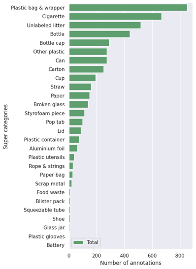
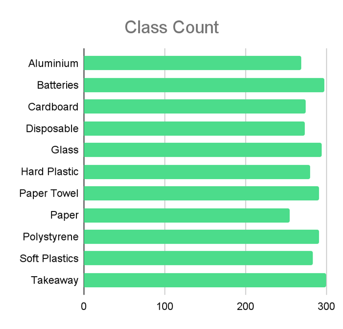
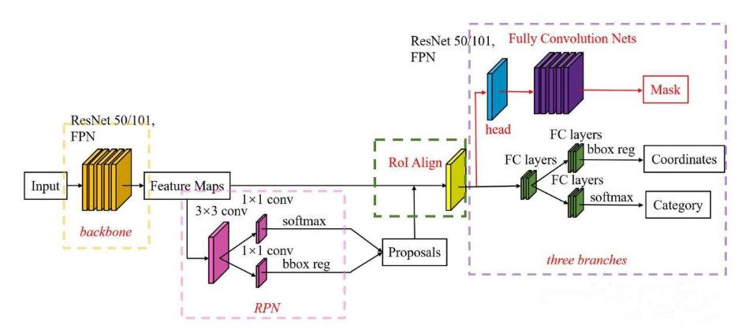
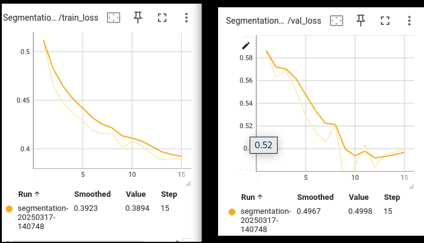
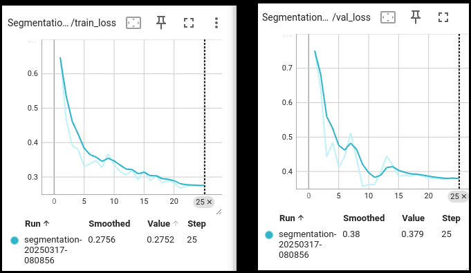
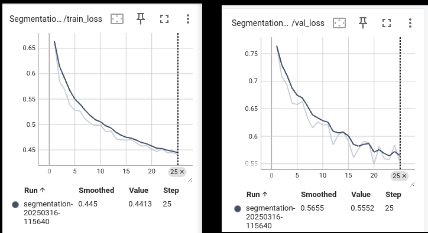
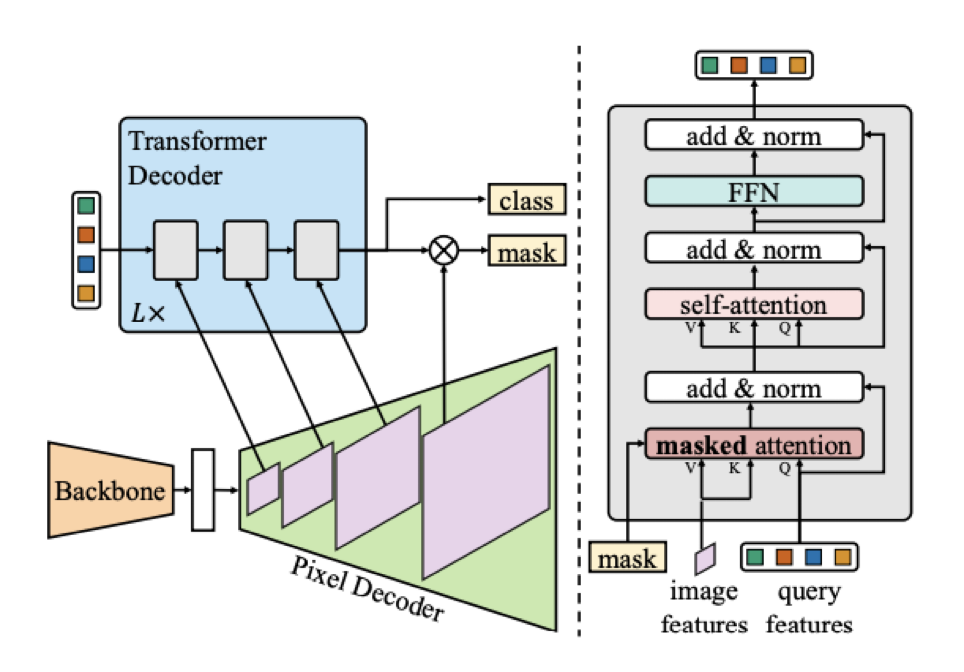
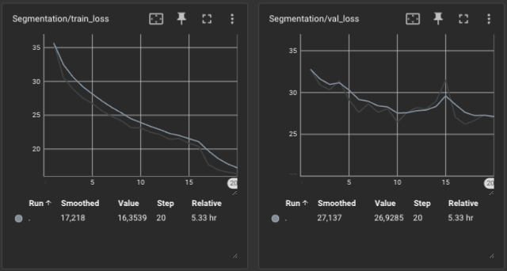
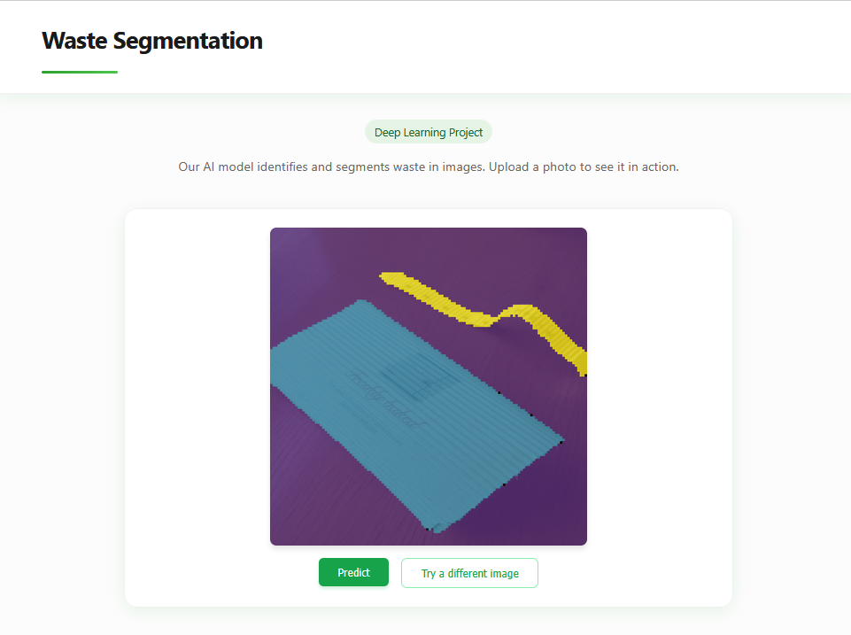

# Waste Segmentation and detection AIDL project

This repository contains the code developed by Martí Fabregat, Rafel Febrer, Ferran Miró-Gea and Miguel Ortiz in the scope of AIDL postgraduate course in UPC (Universitat Politècnica de Catalunya). With supervision of Amanda Duarte.

Several models for instance segmentation and image classification have been trained and evaluated to segment and classify waste.

## Table of Contents
- [Getting started](#getting-started)
  - [Requirements](#requirements)
  - [Datasets](#datasets)
    - [TACO Dataset](#taco-dataset)
    - [Viola77](#viola77)
  - [Exploratory data analysis](#exploratory-data-analysis)
- [Training](#training)
  - [Image Classification with ResNet-50](#image-classification-with-resnet-50)
    - [Split dataset](#split-dataset)
    - [Dataset classes](#dataset-classes)
      - [ResNet-50 for Viola77](#resnet-50-for-viola77)
    - [Train](#train)
    - [Evaluate](#evaluate)
    - [Results](#results)
  - [Image Classification with ViT](#image-classification-with-vit)
    - [Split dataset](#split-dataset-1)
    - [Dataset classes](#dataset-classes-1)
      - [ViT for Viola77](#vit-for-viola77)
      - [ViT for Taco + Viola77](#vit-for-taco--viola77)
    - [Train](#train-1)
    - [Evaluate](#evaluate-1)
    - [Results](#results-1)
  - [Instance segmentation with Mask R-CNN](#instance-segmentation-with-mask-r-cnn)
    - [Split dataset](#split-dataset-2)
    - [Dataset classes](#dataset-classes-2)
    - [Train](#train-2)
    - [Evaluate](#evaluate-2)
    - [Results](#results-2)
  - [Instance segmentation with Mask2Former](#instance-segmentation-with-mask2former)
    - [Split dataset](#split-dataset-3)
    - [Dataset classes](#dataset-classes-3)
    - [Train](#train-3)
    - [Evaluate](#evaluate-3)
    - [Results](#results-3)
- [MLOps](#mlops)
  - [Running the application with Docker](#running-the-application-with-docker)
  - [Google Cloud](#google-cloud)
  - [API](#api)
- [Demo](#demo)

## Getting started

### Requirements 

Create a conda environment by running
```
conda create --name waste-management python=3.12.8
```

Then, activate the environment
```
conda activate waste-management
```

To install the required python packages simply type
```
pip3 install -r requirements_TACO.txt
```

### Datasets

#### TACO Dataset

The model has been trained using [TACO Dataset](http://tacodataset.org) by Pedro F Proença and Pedro Simões. For more details check the paper: https://arxiv.org/abs/2003.06975

To download the dataset images simply use:
```
python -m scripts.download
```

In case of image classification the taco dataset is divided in its annotations and the background is removed, so that the waste is surrounded by back pixels.
This allows to use the Taco Dataset as a waste image classification dataset.

For image segmentation the Taco dataset is used "as it is".

The categories that will be used for classification and segmentation depend on the subversion of Taco Dataset selected.

* **Taco28** - Contains the complete Taco Dataset using the 28 supercategories as labels.
* **Taco5** - Contains a subsample of the images of the original Taco Dataset. (5 labels only). It is an "easier" task.
* **Taco1** - Contains the complete Taco Dataset using only 1 category as label ("waste").

As can be seen taco is a unbalanced dataset for waste image segmentation:


#### Viola77

The [Viola77](https://huggingface.co/datasets/viola77data/recycling-dataset) dataset is used as well for classification. Under Apache 2.0 License.

Viola is a close to perfectly balanced dataset:



#### Combination of Datasets

A combination of Taco and Viola77 Datasets have been created to increase the number of images for image classification tasks to test models under different situations.

* **taco39viola11** - Contains a Taco Dataset subsection of annotations that match the Viola categories plus the Viola Dataset, so it is the Dataset with the biggest number of images for classification.


### Exploratory data analysis

#### TACO Dataset

Explore the notebook ``demo.ipynb``, modified version of the original notebook from the [TACO Repository](https://github.com/pedropro/TACO) that inspects the dataset.
The dataset is in COCO format. It contains the source pictures, anotations and labels. For more details related with the datasource please refer to [TACO Repository](https://github.com/pedropro/TACO).

#### Viola77 Dataset
Explore the notebook ``eda_viola.ipynb``. This Notebook contains and exploratory data analysis for the viola dataset and its classes, labels and distribution. For mor details related with the dataset please take a look into: https://huggingface.co/datasets/viola77data/recycling-dataset.

## Training

### Image Classification with ResNet-50
#### Split dataset
To split the annotations for training and evaluation on **ResNet-50** use ``split_dataset.py`` according to this explanation. It has several optional flags.
```
python -m scripts.split_dataset --dataset_dir=data --dataset_type=classification [--test_percentage=0.1] [--val_percentage=0.1] [--seed=123] [--verbose=False] 
```
* Indicate the annotations directory using ``--dataset_dir``.
* Indicate the dataset to use with ``--dataset_type`` flag. In case of classification use:
    * ``--dataset_type=classification``
    (Use it to run classification in taco28, taco5 or taco30viola11).
##### Optional:
* Use ``--test_percentage`` if you want to use a test split different than default 0.1 (10%).
* Use ``--val_percentage`` if you want to use a validation split different than default 0.1 (10%).
* Use ``--seed`` if you want to have a different random output. Default 123.
* Use ``--verbose`` (bool) if you want to have printed text on the console during execution.
#### Dataset classes
##### ResNet-50 for Viola77

This repository provides an implementation of ResNet-50 for waste classification using the Viola77 dataset. It includes scripts for hyperparameter optimization using Optuna, model training, and evaluation. 

##### Prerequisites

Ensure you have the following dependencies installed:

```bash
pip install torch torchvision transformers optuna numpy pandas matplotlib seaborn scikit-learn tqdm datasets
```

#### Scripts Overview

##### 1. `viola_dataset_resnet.py`
- **Description:** Custom PyTorch dataset class for the Viola77 dataset.
- **Inputs:**
  - Hugging Face dataset
- **Outputs:**
  - Preprocessed dataset for training and testing

##### 2. `optuna_resnet_hparams.py`
- **Description:** Uses Optuna to find the best hyperparameters for training the ResNet-50 model.
- **Inputs:**
  - Search space includes learning rate, dropout rate and optimizer type.
- **Outputs:**
  - Saves the best hyperparameters in `hparams.json`.

##### 3. `train_resnet_classification_opt.py`
- **Description:** Trains a ResNet-50 model on the Viola77 dataset.
- **Inputs:**
  - Dataset from Hugging Face (`viola77data/recycling-dataset`)
  - If `enhanced_hparams=True`, executes `optuna_resnet_hparams.py` first to determine the best hyperparameters before training.
- **Outputs:**
  - Saves the trained model as `best_resnet50.pth`
  - Generates training metrics and confusion matrices

##### 4. `test_resnet_classification.py`
- **Description:** Evaluates the trained ResNet-50 model on the test dataset.
- **Inputs:**
  - Loads `best_resnet50.pth`
  - Uses the Viola77 test dataset
- **Outputs:**
  - Accuracy, classification report, confusion matrix

#### How to Run

1. **Train the Model**
- Without optimized hyperparameters:
```bash
python -m scripts.train_resnet_classification_opt
```

##### Optional:
* Use ``--enhanced_hparams`` if you want to enhance the hparameters with the optuna library. This option will exectute the script: optuna_resnet_hparams.py
  ```bash
  if args.enhanced_hparams:
    os.system("python -m utilities.optuna_resnet_hparams")
  ```
* Use ``--lr`` if you want to use a different learning rate than default 0.00002.
* Use ``--dropout`` if you want to use a dropout percentage different than default 0.2674 (26,74%).
* Use ``--epochs`` if you want to use different epochs value than the default 15. 

2. **Test the Model**
```bash
python -m scripts.test_resnet_classification.py
```

#### Results

Include plots and metrics here:

- **Training Loss & Accuracy:**
  
  

- **Confusion Matrix (Train & Test):**
  - **Train**:

    

  - **Test**:
    
    

- **Evaluation Histogram**:
  
  
    
- **Classification Report:**
```
                   precision    recall  f1-score   support

        aluminium       0.57      0.88      0.70        26
        batteries       0.91      0.88      0.89        24
        cardboard       0.74      0.93      0.82        15
disposable plates       0.88      0.92      0.90        24
            glass       0.85      0.63      0.72        35
     hard plastic       0.48      0.52      0.50        25
            paper       0.79      0.68      0.73        34
      paper towel       0.84      1.00      0.91        31
      polystyrene       0.80      0.71      0.75        34
    soft plastics       0.68      0.52      0.59        33
    takeaway cups       0.90      0.90      0.90        30

         accuracy                           0.76       311
        macro avg       0.77      0.78      0.76       311
     weighted avg       0.77      0.76      0.76       311

```
     
- **Overall Accuracy: 0.7621**


### Image Classification with ViT
#### Split dataset
To split the annotations for training and evaluation on **ViT** use ``split_dataset.py`` following the same procedure as in **ResNet-50**.
```
python -m scripts.split_dataset --dataset_dir=data --dataset_type=classification [--test_percentage=0.1] [--val_percentage=0.1] [--seed=123] [--verbose=False] 
```

#### Dataset classes
##### ViT for Viola77
The Viola77 dataset for Image classification in ``custom_datasets/viola77_dataset.py`` has the functionality to load the Viola77 Dataset in for Image Classification.

##### ViT for Taco + Viola77
The Viola77 dataset for Image classification in ``custom_datasets/viola77_dataset.py`` has the functionality to load the Viola77 Dataset in for Image Classification.
#### Train
`python -m scripts.train_resnet_classification`

#### Evaluate
`python -m scripts.test_vit_classification --model_path [model_path] --image_path [image_path]`

- model_path is the path to the model checkpoint (mandatory)
- image_path is an optional parameter to the path where the image is located. If not set, then an evaluation with the whole dataset is done.

#### Results

### Instance segmentation with Mask R-CNN
#### Split dataset
To split the annotations for training and evaluation in **Mask R-CNN** use ``split_dataset.py``.

```
python -m scripts.split_dataset --dataset_dir=data --dataset_type=taco1 [--test_percentage=0.1] [--val_percentage=0.1] [--seed=123] [--verbose=False]
```
* Indicate the annotations directory using ``--dataset_dir``.
* Indicate the dataset to use with ``--dataset_type`` flag. It depends on the task to do. It can be:
    * ``taco28`` for **instance segmentation** in *taco28* dataset (Taco dataset with 28 categories, includes all data)
    * ``taco5`` for **instance segmentation** in *taco5* dataset (Taco dataset with a subsample of 5 categories)
    * ``taco1`` for **instance segmentation** in *taco1* dataset (Taco dataset only segmenting waste from background, includes all data)
##### Optional:
* Use ``--test_percentage`` if you want to use a test split different than default 0.1 (10%).
* Use ``--val_percentage`` if you want to use a validation split different than default 0.1 (10%).
* Use ``--seed`` if you want to have a different random output. Default 123.
* Use ``--verbose`` (bool) if you want to have printed text on the console during execution.

#### Dataset classes
The Taco Dataset for mask R-CNN class in ``custom_datasets/taco_dataset_mask_r_cnn.py`` has the functionality to load the Taco Dataset in for Instance Segmentation.

#### Train
For train Mask R-CNN  we use Resnet-50 as backbone and freeze all layer except Feature Pyramid Network (FPN). The other layers that train too are Region Proposal Network (RPN) and all the layers that are in Roi Heads that include the predictors for bounding boxes and maks.

To train mask-rcnn in any of the dataset, do:
```
python -m scripts.train_mask_r_cnn
```

Checkpoints will be saved in the results/mask_r_cnn folder.

#### Evaluate
To evaluate the model in the test set of the dataset, do:
```
python -m scripts.test_mask_r_cnn --checkpoint_path your_checkpoint_path
```

#### Results
The metric we use is mAP of torch.metrics. The results are not good. The hipotesi is that the code that ajust the model make it that don't predict well and as mAP are sensible to bag predictions so the result are low.
##### Taco1
- **Description**:
Train Mask R-CNN in taco1 dataset. Overfiting begin at epoch 12 so stop the train and evaluate at 12 checkpoint.
- **Outputs**:


- **Metrics**

Metric | Value
--- | ---
bbox_map |  0.21
bbox_map_50 |  0.40
bbox_map_75 |  0.20
bbox_map_small |  0.14
bbox_map_medium |  0.34
bbox_map_large |  0.23
bbox_mar_1 |  0.17
bbox_mar_10 |  0.34
bbox_mar_100 |  0.39
bbox_mar_small |  0.30
bbox_mar_medium |  0.51
bbox_mar_large |  0.40
segm_map |  0.25
segm_map_50 |  0.40
segm_map_75 |  0.26
segm_map_small |  0.11
segm_map_medium |  0.39
segm_map_large |  0.34
segm_mar_1 |  0.21
segm_mar_10 |  0.39
segm_mar_100 |  0.43
segm_mar_small |  0.29
segm_mar_medium |  0.57
segm_mar_large |  0.50
Avg. IoU (respect labels) | 0.09
Avg. IoU (no respect labels) | 0.09
Avg. False positives rate | 0.00
Avg. False negatives rate | 0.01

predicted classes |  1
##### Taco5
- **Description**:
Train Mask R-CNN in taco5 dataset.
- **Outputs**:


- **Metrics**

Metric | Value
--- | ---
bbox_map |  0.16
bbox_map_50 |  0.42
bbox_map_75 |  0.07
bbox_map_small |  0.20
bbox_map_medium |  0.19
bbox_map_large |  0.19
bbox_mar_1 |  0.28
bbox_mar_10 |  0.31
bbox_mar_100 |  0.31
bbox_mar_small |  0.20
bbox_mar_medium |  0.49
bbox_mar_large |  0.30
segm_map |  0.31
segm_map_50 |  0.38
segm_map_75 |  0.34
segm_map_small |  0.08
segm_map_medium |  0.37
segm_map_large |  0.43
segm_mar_1 |  0.39
segm_mar_10 |  0.48
segm_mar_100 |  0.48
segm_mar_small |  0.15
segm_mar_medium |  0.72
segm_mar_large |  0.43
Avg. IoU (respect labels) | 0.27
Avg. IoU (no respect labels) | 0.31
Avg. Complete IoU (respect labels) | 0.06
Avg. Complete IoU (no respect labels) | 0.12
Avg. False positives rate | 0.58
Avg. False negatives rate | 0.10

predicted classes:  [1, 2, 3, 4, 5]
##### Taco28
- **Description**:
Train Mask R-CNN in taco28 dataset.
- **Outputs**:


- **Metrics**

Metric | Value
--- | ---
bbox_map |  0.04
bbox_map_50 |  0.09
bbox_map_75 |  0.04
bbox_map_small |  0.03
bbox_map_medium |  0.09
bbox_map_large |  0.09
bbox_mar_1 |  0.10
bbox_mar_10 |  0.13
bbox_mar_100 |  0.14
bbox_mar_small |  0.07
bbox_mar_medium |  0.20
bbox_mar_large |  0.21
segm_map |  0.07
segm_map_50 |  0.11
segm_map_75 |  0.07
segm_map_small |  0.03
segm_map_medium |  0.14
segm_map_large |  0.15
segm_mar_1 |  0.14
segm_mar_10 |  0.18
segm_mar_100 |  0.18
segm_mar_small |  0.09
segm_mar_medium |  0.26
segm_mar_large |  0.29
Avg. IoU (respect labels) | 0.24
Avg. IoU (no respect labels) | 0.05
Avg. False positives rate | 0.83
Avg. False negatives rate | 0.32

predicted classes:  [1, 4, 5, 6, 7, 8, 9, 10, 13, 14, 15, 17, 18, 20, 21, 22, 23, 26, 27, 28]
### Instance segmentation with Mask2Former
#### Split dataset
To split the annotations for training and evaluation on **Mask2Former** use ``split_dataset.py`` following the same procedure as in **Mask R-CNN**.

```
python -m scripts.split_dataset --dataset_dir=data --dataset_type=taco1 [--test_percentage=0.1] [--val_percentage=0.1] [--seed=123] [--verbose=False]
```

#### Dataset classes

#### Train
The mask2former model has been finetunned using the weights from ``facebook/mask2former-swin-tiny-ade-semantic``.


To train mask2former model in any of the datasets, do:
```
python -m scripts.train_mask2former_segmentation --dataset_type=taco1 [--batch_size=1] [--checkpoint_path=your_checkpoint_path]
```
Checkpoints will be saved in the results folder.

#### Evaluate
To evaluate the model in the test set of the dataset, do:
```
python -m scripts.test_mask2former_segmentation --checkpoint_path=your_checkpoint_path
```
parser.add_argument('--checkpoint_path', required=False, help='Checkpoint path', type=str, default="")

#### Results
In general Mask2former learns to segment well the background from the waste but fails mostly in classifying the waste.
Notice that, because of the unbalance of the dataset some classes may never apear in the test dataset and therefore the mIoU could be 0.

##### Taco1
- **Description**:
Training of the Mask2former using the taco1 dataset in the task of instance segmentation.

- **Outputs:**
Train of the Mask2former in taco1 for 12 epochs:

Best model is found at epoch 20. Despite loss bottomed at epoch 18 valuation metrics (mIoU) kept going up and therefore epoch 20 looks still a bit more promissing. Maybe further learning could be conducted to improve results.

- **Metrics**:

Categories | mIoU
--- | ---
Background | 0.991115391254425
Waste | 0.6704526543617249

##### Taco5
- **Description**:
Training of the Mask2former using the taco5 dataset in the task of instance segmentation.

- **Outputs:**
Train of the Mask2former in Taco5 for 20 epochs:

In this case, the best model is not that simple to determine. Despite loss bottomed at epoch 13 valuation metrics (mIoU) kept going up for most of the categoies (except class 3 - Cup) and therefore epoch 20 looks more promissing. Maybe further learning could be conducted to improve results.


- **Metrics**:

Categories | mIoU
--- | ---
Background | 0.9847108721733093
Bottle | 0.05829409137368202
Carton | 0.07693199068307877
Cup | 0.12679843604564667
Can | 0.1528954803943634
Plastic film | 0.0

##### Taco28
- **Description**:
Training of the Mask2former using the taco28 dataset in the task of instance segmentation.

- **Outputs:**
Train of the Mask2former in Taco28 for 20 epochs:

Best model is found at epoch 20. Despite loss bottomed at epoch 17 valuation metrics (mIoU) kept going up and therefore epoch 20 looks still a bit more promissing. Maybe further learning could be conducted to improve results.

- **Metrics**:

Categories | mIoU
--- | ---
Background | 0.9908596873283386
Aluminium foil | 0.0
Battery | 0.0
Blister pack | 0.0
Bottle | 0.09910181164741516
Bottle cap | 0.043327733874320984
Broken glass | 0.0
Can | 0.060843873769044876
Carton | 0.05095602571964264
Cigarette | 0.015832440927624702
Cup | 0.03592093661427498
Food waste | 0.0
Glass jar | 0.0
Lid | 0.012202137149870396
Other plastic | 0.020540520548820496
Paper | 0.016484104096889496
Paper bag | 0.0
Plastic bag & wrapper | 0.1564932018518448
Plastic container | 0.0
Plastic glooves | 0.0
Plastic utensils | 0.0
Pop tab | 0.0
Rope & strings | 0.0028102947399020195
Scrap metal | 0.0
Shoe | 0.0
Squeezable tube | 0.0
Straw | 0.00902826339006424
Styrofoam piece | 0.008733779191970825
Unlabeled litter | 0.0053437091410160065


## MLOps

### Running the application with Docker
Build the image with:
```docker build -t waste-detection-app .```

Run specific Python file:
```docker run --rm waste-detection-app <FILE_NAME.py>```

### Google Cloud
This repository automates the setup of the GCP infrastructure. It contains the following Bash scripts:
- `./setup_gcp_infrastructure.sh ` for setting up a VM, pull a Git repository and run the `startup_script.sh`.
- `./delete_gcp_infrastructure.sh ` for deletting the infrastructure.
- `./upload_model_checkpoint.sh` to upload checkpoint files to a shared Google Cloud Storage.
- `./download_model_checkpoint.sh` to download checkpoint files from a shared Google Cloud Storage to the local instance.

Further details on Google Cloud setup and utilities can be found in the [GCP Utils Documentation](gcp_utils/README.md).

### API
To evaluate images outside the dataset an API with WebApp has been developed.

#### API configuration:
Before launching the API you need to create a `.env` file in the project root folder.

The `.env` file contains 3 variables, for example:
```
FLASK_SECRET_KEY=secret_key
MODEL_NAME=MASK2FORMER
CHECKPOINT=checkpoint_epoch_7_mask_rcnn_taco1.pt
```
The `MODEL_NAME` can be `MASK2FORMER` or `MASK_R-CNN`. The API has not been abilitated yet for classification models.

The checkpoints of the models to test for the app should be placed in the folder `app/checkpoint`.


### Running the API
To run the api in local and in debug mode, do:
```python -m app.app```
The flask app will be launched in your localhost.

## Demo
By using the developed API the user can detect waste using the API or by using the web app (GUI). In the following points is explained how to interact with.

### Test images with API
Make sure the API is running in your localhost. Then, use the example code provided in the file ``test_api.py`` to create you own request to the API.
Just run:
```python -m app.test_api```
The API will process the pictures sent and will return the detections and the images with the segmentation.
Check ``app/results``folder after running test_api.py to see the results.

### WebApp GUI
The WebApp allows to process images in a more user frendly approach.
To use the user interface open your prefered browser and connect to your localhost port 8000: http://localhost:8000.

If the API is running you should get to the home page:

**Select a picture** and click on **Upload**.

You should see your picture in the web.

Click on **Predict** to generate the segmentations.

The output will be different according to the model used in the API. Here an example:

To try another picture use the **Try a different image** button.

