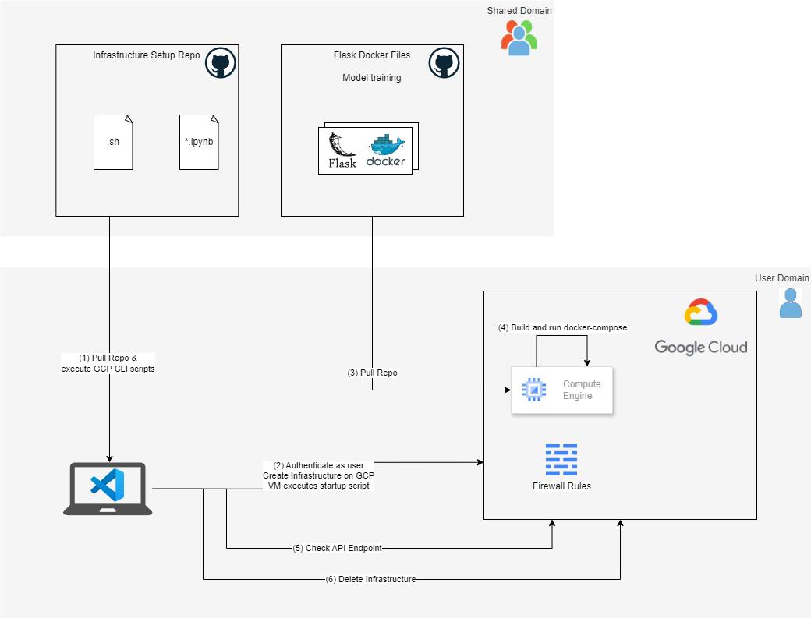

# Google Cloud Utils

This repository automates the setup of the GCP infrastructure as part of the waste detection project in the AIDL postgraduate course at UPC.

It contains the following Bash scripts:
- `./setup_gcp_infrastructure.sh ` for setting up a VM, pull a Git repository and run the `startup_script.sh`.
- `./delete_gcp_infrastructure.sh ` for deletting the infrastructure.
- `./upload_model_checkpoint.sh` to upload checkpoint files to a shared Google Cloud Storage.
- `./download_model_checkpoint.sh` to download checkpoint files from a shared Google Cloud Storage to the local instance.

Additionally, the notebook `test_api.ipynb` has been provided to test an API endpoint, once the model has been deployed.



**Authors**: Martí Fabregat, Rafel Febrer, Ferran Miró-Gea and Miguel Ortiz. Supervised by Amanda Duarte.


## 0. Setup
Start by creating a copy of the config file and rename it to config.env:
`cp config/config.example.env config/config.env`

Set parameters in `config.env` and the GIT_REPO_URL in the `startup-script.sh` which will be passed to the created VM.

Authenticate:
`gcloud auth login`

- if this crashes with MissingCodeError try this:
`gcloud auth login --no-launch-browser`

## 1. Setup GCP Infrastructure

Run `./setup_gcp_infrastructure.sh ` for setting up the infrastructure.

This will create a VM in your GCP project, pull a repository (by default with a Flask Docker container) and start the container.

This process can take a few minutes (~7-8 minutes).

You can test the API by opening the `PUBLIC_IP:5000` in a browser or using the `test_api.ipynb` notebook.


### Debugging and starting the docker container 

To check the logs at the VM, ssh into the VM using either the GCP Console (browser) or running in the terminal the following command:
`gcloud compute ssh <VM_NAME> --zone <ZONE>`

Note that `<ZONE>` is a sub-zone inside of a location. Typically the zone will be equal to `<LOCATION>`+`-a`

In the VM check the logs with `nano /tmp/startup-script.log`

Change to project directory with `cd /opt/docker-app`

Build Docker Container with `sudo docker build -t waste-detection-app .`

Run specific Python file:
```sudo docker run --rm -it --gpus all waste-detection-app <FILE_NAME.py>```
E.g.: ```sudo docker run --rm -it --gpus all waste-detection-app -m scripts.train_vit_classification```


## 2. Deleting the GCP Infrastructure

To delete the VM and the firewall rule run the following command:
` ./delete_gcp_infrastructure.sh `

## 3. Uploading Checkpoints

- **Purpose**: Compresses all checkpoint files in a local directory and uploads them to GCS with a timestamped folder.

### Prerequisites

- Google Cloud SDK installed (`gsutil`).
- Google Cloud Storage bucket set up.
- Access permissions to the bucket.

### Usage

**Run the script**:
```
chmod +x upload_model_checkpoint.sh
./upload_model_checkpoint.sh
```

You have to modify the following variables in the script:

- `LOCAL_CHECKPOINT_PATH`: Path to your local checkpoint directory.
- `BUCKET_NAME`: Your GCS bucket name.
- `GCS_DESTINATION_PATH`: Base path in the GCS bucket.

### 4. Downloading Model Checkpoint

- **Purpose**: Downloads the checkpoint file from the specified GCS bucket and extracts it to the local system.

### Prerequisites

- Google Cloud SDK installed (`gsutil`).
- Google Cloud Storage bucket set up.
- Access permissions to the bucket.

**Run the script**:
```
chmod +x download_model_checkpoint.sh
./download_model_checkpoint.sh
```
You have to modify the following variables in the script:

- `BUCKET_PATH`: Full GCS path to where checkpoints are stored
- `LOCAL_SAVE_PATH`: Where to extract the checkpoint